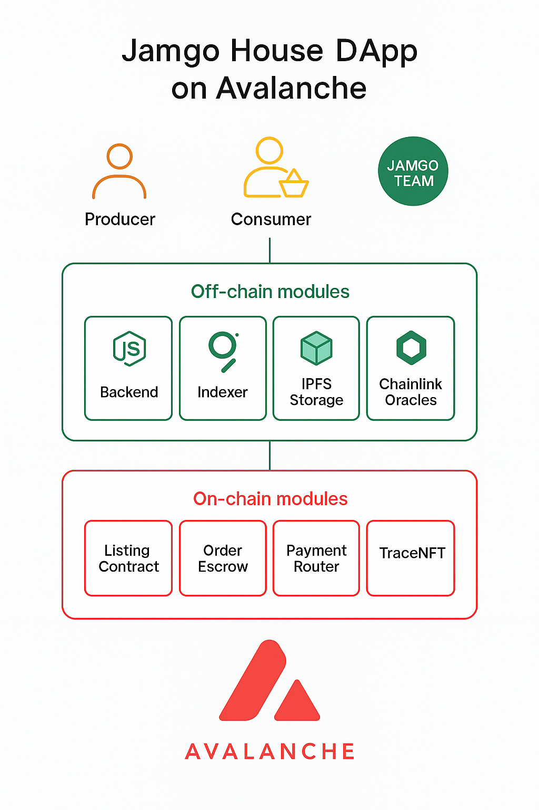
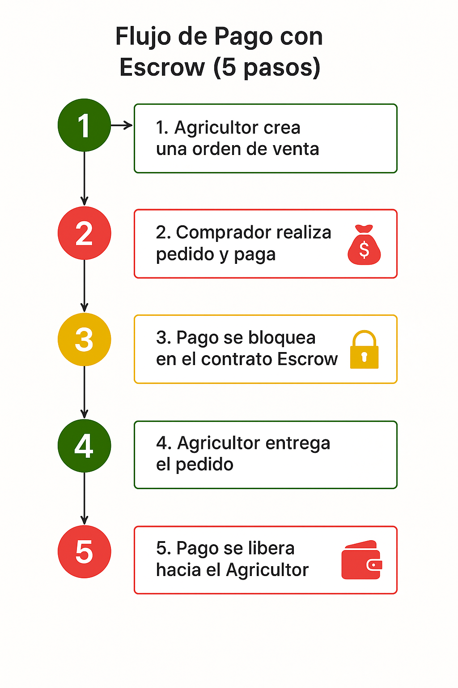

# 🥭 Jamgo House: Donde Cada Mango Cuenta  
**Trazabilidad y Comercio Justo sobre Avalanche Blockchain**  
Hackathon Avalanche Build – Categoría: Impacto Social & Comunidad  

---

## 🚀 Descripción
Jamgo House es una DApp que conecta productores rurales con consumidores urbanos mediante **contratos inteligentes en Avalanche (Fuji Testnet)**.  
Permite **listar ofertas de mango**, **recibir pagos seguros con escrow**, y **liberar los fondos** una vez confirmada la entrega, garantizando transparencia y comercio justo.

> “Cada mango cuenta. Cada productor importa.  
> **Avalanche hace posible devolver el valor que la tierra se merece.**”

---

## 🧱 Arquitectura del Sistema

**Niveles principales:**
1. **Usuarios (Capa superior):** Productores, Consumidores y el Equipo Jamgo.  
2. **Off-chain (Capa intermedia):** Backend Node.js, Indexador *The Graph*, almacenamiento IPFS y oráculos Chainlink.  
3. **On-chain (Capa base):** Contratos inteligentes en Avalanche:  
   - `ListingContract` → Publica ofertas de mango.  
   - `OrderEscrow` → Gestiona pagos y liberación de fondos.  
   - `TraceNFT` → (Próxima versión) Certificados NFT de trazabilidad.

---

## 💸 Flujo de Pago con Escrow

**Pasos del flujo:**
1️⃣ Productor publica su oferta.  
2️⃣ Consumidor paga → los fondos quedan en *escrow*.  
3️⃣ Se valida la entrega.  
4️⃣ El sistema libera el pago al productor.  
5️⃣ Se genera un NFT de trazabilidad (en desarrollo).

---

## ⚙️ Contratos en Fuji Testnet

| Contrato | Dirección | Descripción |
|-----------|------------|-------------|
| ListingContract | 0xd9145CCE52D386f254917e481eB44e9943F39138 | Publicación de ofertas de mango |
| OrderEscrow | `0xd8b934580fcE35a11B58C6D73aDeE468a2833fa8| Administración de pagos y fondos en escrow |

🔗 **Ver en Snowtrace:** 
https://subnets-test.avax.network/c-chain/tx/0x0f62f9b334fe0e01efa202b6676012362a630d3345465998ea97b8a97341f67c

## Billetera con transacciones (Fuji Testnet)
0x4A05a392ec090dC33943b7B7a054A7b7EE1cd93B
https://testnet.snowtrace.io/address/0x4A05a392ec090dC33943b7B7a054A7b7EE1cd93B

## 🧪 Pruebas en Remix (Evidencia On-Chain)
Ejecución completa en Avalanche Fuji Testnet.

---

## 🧪 Cómo probarlo (Remix + Core Wallet / MetaMask)

1️⃣ Conéctate a **Avalanche Fuji Testnet**.  
   - RPC: `https://api.avax-test.network/ext/bc/C/rpc`  
   - Faucet: [https://faucet.avax.network](https://faucet.avax.network)

2️⃣ En Remix:  
   - Compila `ListingContract.sol` y **Deploy**.  
   - Copia la dirección del contrato desplegado.  
   - Compila `OrderEscrow.sol` → **Deploy**, pegando esa dirección en el constructor.  

3️⃣ En `ListingContract` ejecuta:
createListing("Mango Manzano", 1000000000000000, 10, "ipfs://demo")

go
Copiar código

4️⃣ En `OrderEscrow` ejecuta:
payOrder(1, 1)

markdown
Copiar código
➡ En el campo **Value**, pon `1000000000000000` (0.001 AVAX)

5️⃣ Luego ejecuta:
release(1)

yaml
Copiar código
✅ Fondos liberados al productor.  

## 📱 Prototipo Visual (PDF)
✨ **Interfaz de Usuario – Flujo del Consumidor y Productor**  
👉 [Abrir PDF del Prototipo](docs)

> El prototipo muestra cómo los usuarios publican ofertas y visualizan la trazabilidad de cada mango.

---

---

## 📄 Documentación y recursos
# Whitepaper
https://github.com/jamgohouse-ops/JamgoHouse-DApp/blob/main/docs/whitepaper%20jamgo%20house.pdf

# Arquitectura del Sistema
https://github.com/jamgohouse-ops/JamgoHouse-DApp/blob/main/docs/architecture_diagram.png.png

# Flujo de Pago con Escrow
https://github.com/jamgohouse-ops/JamgoHouse-DApp/blob/main/docs/escrow_flow.png

---

## 🧰 Stack tecnológico

| Capa | Tecnología |
|------|-------------|
| Blockchain | Avalanche (Fuji Testnet) |
| Lenguaje | Solidity 0.8.26 |
| Frontend | HTML + Web3.js (versión futura) |
| Infraestructura | IPFS, Chainlink, The Graph |
| Origen del Proyecto | Avalanche Build Hackathon 2025 |

---

## 🌱 Impacto Social
Jamgo House busca reducir pérdidas de fruta, mejorar la trazabilidad del agro panameño y aumentar los ingresos de pequeños productores a través de la tokenización responsable.  

> En Jamgo House, cada mango es una historia,  
> cada venta es una conexión,  
> y cada transacción es una semilla de confianza. 🌍

---

## 📜 Licencia
MIT — ver [LICENSE](LICENSE)

# JamgoHouse-DApp
DApp de trazabilidad y escrow en Avalanche para comercio justo de mango

