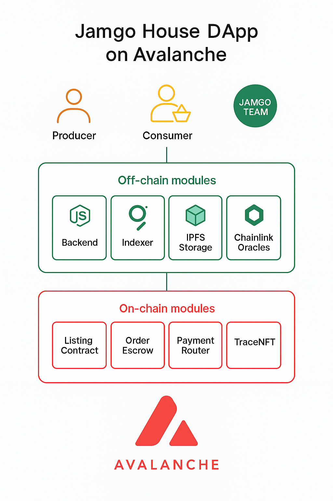

# 🥭 Jamgo House: Donde Cada Mango Cuenta  
**Trazabilidad y Comercio Justo sobre Avalanche Blockchain**  
Hackathon Avalanche Build – Categoría: Impacto Social & Comunidad  

---

## 🚀 Descripción
Jamgo House es una DApp que conecta productores rurales con consumidores urbanos mediante **contratos inteligentes en Avalanche (Fuji Testnet)**.  
Permite **listar ofertas de mango**, **recibir pagos seguros con escrow**, y **liberar los fondos** una vez confirmada la entrega, garantizando transparencia y comercio justo.

> “Cada mango cuenta. Cada productor importa.  
> **Avalanche hace posible devolver el valor que la tierra se merece.**”

---

## 🧱 Arquitectura del Sistema


**Niveles principales:**
1. **Usuarios (Capa superior):** Productores, Consumidores y el Equipo Jamgo.  
2. **Off-chain (Capa intermedia):** Backend Node.js, Indexador *The Graph*, almacenamiento IPFS y oráculos Chainlink.  
3. **On-chain (Capa base):** Contratos inteligentes en Avalanche:  
   - `ListingContract` → Publica ofertas de mango.  
   - `OrderEscrow` → Gestiona pagos y liberación de fondos.  
   - `TraceNFT` → (Próxima versión) Certificados NFT de trazabilidad.

---

## 💸 Flujo de Pago con Escrow


**Pasos del flujo:**
1️⃣ Productor publica su oferta.  
2️⃣ Consumidor paga → los fondos quedan en *escrow*.  
3️⃣ Se valida la entrega.  
4️⃣ El sistema libera el pago al productor.  
5️⃣ Se genera un NFT de trazabilidad (en desarrollo).

---

## ⚙️ Contratos en Fuji Testnet

| Contrato         | Dirección | Descripción |
|------------------|----------|-------------|
| ListingContract  | 0x9cbe48371eCB77FD190F31E97ddfB8e70f6ed88a| Publicación de ofertas |
| OrderEscrow      | 0x6ADAa607d3B0E5c17649042B8104B03B40130e0b| Pagos y fondos en escrow |
| TraceMangoNFT    | 0x6a71f2a510b989Fe283ad33F239C9Bf3582993b6| NFT de trazabilidad (TMGO) |

Pruebas on-chain (Snowtrace):
(cuenta del productor)
- ListingContract → https://testnet.routescan.io/address/0x9cbe48371eCB77FD190F31E97ddfB8e70f6ed88a/contract/43113/code
  
-OrderEscrow BaseURI(necesario para orderEscrow) ejemplobaseURI  → bafybeid4yh7jtlbglqslhw2lckfxiaqb2hf5f7cqcjcocnumfmn3xhfj5a
→https://testnet.routescan.io/address/0x6ADAa607d3B0E5c17649042B8104B03B40130e0b/contract/43113/code

-TraceMangoNFT(te va a pedir el _minter address que es la direcciòn del OrderEscrow)
 → https://testnet.routescan.io/address/0x6a71f2a510b989Fe283ad33F239C9Bf3582993b6/contract/43113/code
 
-En ListingContract → llama createListing("Mango Manzano", 1000000000000000, 10, "ipfs://demo")
- createListing → https://testnet.routescan.io/tx/0xc58deca51c3e1593e1cc3afa32b36479bf90e71a0280313499a12ccff4e6998b?chainid=43113
  
(cambiamos a cuenta comprador)
(para saber la direccion del productor la cantidad disponible y el id podras consultarlo en getlisting en el contrato listingcontract)
- payOrder → (https://testnet.routescan.io/tx/0x36b7ddc45aa54ac10c14d22a77b3963f2f1cafe3af396126128aa91a37f8e460)
- (aqui el comprador confirma que recibio los mangos)
- release (mint NFT) → https://testnet.snowtrace.io/tx/0x…
---

## 🧪 Cómo probarlo (Remix + Core/MetaMask)

1) Red Fuji  
   - RPC: `https://api.avax-test.network/ext/bc/C/rpc`  
   - Faucet: https://faucet.avax.network

2) Despliegue
- `ListingContract` → Deploy
- `OrderEscrow` → Deploy con `baseURI = "ipfs://<TU_CID_DE_CARPETA>/"`  *(incluye barra final)*
- `TraceMangoNFT` → Deploy con `_minter = <DIRECCIÓN_DEL_ESCOw>`  
- En `OrderEscrow`: `setNFTContract(<DIRECCIÓN_NFT>)`

3) Crear una oferta (como **productor**)
- `createListing("Mango Manzano", 1000000000000000, 10, "ipfs://demo")`  
  *(0.001 AVAX/kg; stock 10 kg)*

4) Pagar pedido (como **comprador**)
- `payOrder(<ADDR_PRODUCTOR>, 0, 1)` con **Value** `1000000000000000` (0.001 AVAX)  

5) Confirmar entrega y mintear NFT
- `release(0)` → libera fondos al productor y **mintea TMGO #0**  
- Verifica en `TraceMangoNFT`:
  - `ownerOf(0)` = dirección del comprador  
  - `tokenURI(0)` = `ipfs://<TU_CID_DE_CARPETA>/0.json`
### Opciones:
- **A. Usar los contratos ya desplegados (recomendado):**
  1. Copia la dirección del contrato en Remix (`At Address`) y conéctala:
     - `ListingContract` → `0xd6dd2170C10E89cB996C1a5004bF7e64fb9716E1`
     - `OrderEscrow` → `0xD7A951e140d1E72e02c20477616FA1Ff28F9b920`
  2. En `ListingContract` ejecuta:
     ```text
     createListing("Mango Manzano", 1000000000000000, 10, "ipfs://demo")
     ```
     (Value = 0)
     - Verifica la tx: https://testnet.snowtrace.io/tx/0x122cbbdb664e458ff08b02b8c5133bcd41b2bce1055c60cc9825f85f2810f7af
  3. En `OrderEscrow` ejecuta:
     ```text
     payOrder(<DIRECCION_PRODUCTOR>, 0, 1)
     ```
     **Value (wei):** `1000000000000000` (0.001 AVAX)  
     - Verifica la tx: https://testnet.snowtrace.io/tx/0x12da9f389c2a08f37b167531fdf16e28f17df5f9fbd596c28cfec7826c8f6368
  4. Finalmente, con la cuenta que pagó, ejecuta:
     ```text
     release(0)
     ```
### 🎟️ TraceMango (TMGO) — NFT de trazabilidad
Al ejecutar `release(orderId)`, el escrow mintea un NFT al comprador:
- `tokenURI = baseURI + orderId + ".json"` → `ipfs://<CID_CARPETA>/0.json`

Ejemplo `0.json`:
```json
{
  "name": "TraceMango #0 – Mango Manzano",
  "description": "Certificado de trazabilidad Jamgo House sobre Avalanche.",
  "image": "ipfs://<CID_IMAGENES>/mango_manzano.png",
  "attributes": [
    {"trait_type":"Variedad","value":"Mango Manzano"},
    {"trait_type":"Productor","value":"Finca Los Canelos"},
    {"trait_type":"Kg","value":"1"},
    {"trait_type":"Fecha","value":"2025-11-03"}
  ]
}

---

## Billetera con transacciones (Fuji Testnet)
Productor
0x4A05a392ec090dC33943b7B7a054A7b7EE1cd93B productor
https://testnet.snowtrace.io/address/0x4A05a392ec090dC33943b7B7a054A7b7EE1cd93B
Comprador

## 🧪 Pruebas en Remix (Evidencia On-Chain)
Ejecución completa en Avalanche Fuji Testnet.


--- 

## 📱 Prototipo Visual (PDF)
✨ **Interfaz de Usuario – Flujo del Consumidor y Productor**  
👉 [Abrir PDF del Prototipo](docs/Diseño%20Visual%20%20UX%20(Prototipo).pdf)


> El prototipo muestra cómo los usuarios publican ofertas y visualizan la trazabilidad de cada mango.

---

## 📄 Documentación y recursos
# Whitepaper
https://github.com/jamgohouse-ops/JamgoHouse-DApp/blob/main/docs/whitepaper%20jamgo%20house.pdf

# Arquitectura del Sistema
https://github.com/jamgohouse-ops/JamgoHouse-DApp/blob/main/docs/architecture_diagram.png

# Flujo de Pago con Escrow
https://github.com/jamgohouse-ops/JamgoHouse-DApp/blob/main/docs/escrow_flow.png

---

## 🧰 Stack tecnológico

| Capa | Tecnología |
|------|-------------|
| Blockchain | Avalanche (Fuji Testnet) |
| Lenguaje | Solidity 0.8.26 |
| Frontend | HTML + Web3.js (versión futura) |
| Infraestructura | IPFS, Chainlink, The Graph |
| Origen del Proyecto | Avalanche Build Hackathon 2025 |

---

## 🌱 Impacto Social
Jamgo House busca reducir pérdidas de fruta, mejorar la trazabilidad del agro panameño y aumentar los ingresos de pequeños productores a través de la tokenización responsable.  

> En Jamgo House, cada mango es una historia,  
> cada venta es una conexión,  
> y cada transacción es una semilla de confianza. 🌍

---

## 📜 Licencia
MIT — ver [LICENSE](LICENSE)


# JamgoHouse-DApp
DApp de trazabilidad y escrow en Avalanche para comercio justo de mango

